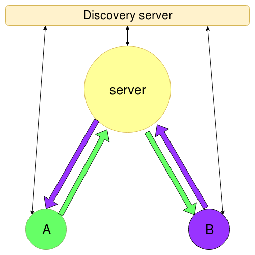

Exchange
========


### Briefly

- `ca` - generates A-feed, and subscribed to B-feed
- `cb` - generates B-feed, and subscribed to A-feed
- `server` - public server that subscribed to A- and B-feed

```
A-feed: 022241cd1857ec73b7741ccb5d5494743e1ef7075ec71d6eca59979fd6be58758c
B-feed: 030c398e49cb77e83baa3110f99a105a33e5caf4e63c4ff55dbbaabbc98159e792
```


Both, `ca` and `cb` are not listening and can't connect between. But the
`server` is listening and the `server` subscribed to A-feed and to B-feed
too.

In the example, the `server` is something like proxy or super-seed. The `ca`
receive B-feed through the `server` and `cb` receive A-feed throut the same
`server`.

All nodes connected to discovery server and the `server` (not discovery server)
is public, that means the `server` share list of its feeds. The discovery server
request list of feeds all nodes interest, and connect them between. But the 
`ca` and the `cb` are not public, and are not listening. Thus, the discovery
server connects them to the `server`.



### Discovery

[Skycoin messenger server](https://github.com/skycoin/net/tree/master/skycoin-messenger/server)

### Run

#### Prepare

Get fresh version of the discovery server

```
go get -d -u github.com/skycoin/net/skycoin-messenger/server
```

#### Start

Four terminals required.

Launch the skycoin messenger server using "[::1]:8008" address in first terminal
```
go run $GOPATH/src/github.com/skycoin/net/skycoin-messenger/server/main.go \
    -address [::1]:8008
```

Launch the `server` first
```
go run $GOPATH/src/github.com/skycoin/cxo/intro/discovery/through/server/server.go
```

In another terminal launch the `ca` node
```
go run $GOPATH/src/github.com/skycoin/cxo/intro/discovery/through/ca/ca.go
```

And finally, in another terminal launch the `cb` node
```
go run $GOPATH/src/github.com/skycoin/cxo/intro/discovery/through/cb/cb.go
```

---
